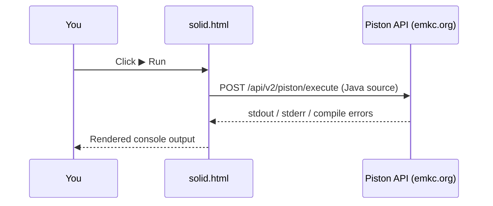

<div align="center">

# 🏗️ SOLID — A Java Field Guide

### Five load-bearing principles, one running story, real code you can run in place.

[](#)
[](#)
[](#-run-the-code-in-place)
[](#-license)
[](#)

**[📖 Read the guide](http://rahmanziaur.github.io/solid)** · **[🌐 More Java on Design Pattern](https://rahmanziaur.github.io/Java)** · **[🐙 Author on GitHub](https://rahmanziaur.github.io/)**

</div>

<br>

<div align="center">

</div>

<br>

---

## 📐 What this is

`solid.html` is a **single self-contained page** that teaches the five SOLID object-oriented design principles through one continuous story — a small team called **Ironclad Retail** fixing their Java order-processing codebase, one principle at a time.

Every principle gets:

| | |
|---|---|
| 📝 | A plain-language **definition** |
| 🧵 | A **scenario** — the specific way Ironclad's code breaks |
| ⚔️ | **Before / After Java code**, side by side |
| ▶️ | A **Run button** that actually executes the code and prints real console output |
| 💡 | A one-line **"why it matters"** takeaway |
| 🎤 | **Interview questions** with model answers |

No build step, no framework, no dependencies — open the file and it works.

<br>

## ✨ Highlights

- **🧠 One story, five refactors** — instead of five disconnected toy examples, every principle continues the same `Ironclad Retail` codebase, so the *relationships* between the principles are visible, not just their definitions.
- **▶️ Code that actually runs** — each snippet has a live **Run** button wired to the public [Piston](https://github.com/engineer-man/piston) execution API. Click it, watch real `javac` + `java` output appear underneath the code. No sign-up, no local JDK required.
- **📋 One-click copy** — every code block has a copy button for dropping straight into your IDE.
- **🎓 Interview-ready** — 3 targeted Q&A per principle, plus a cross-cutting FAQ section (SOLID vs. over-engineering, SOLID vs. design patterns, which principle is hardest).
- **🗂️ Quick-reference table** — the whole acronym on one row-per-letter cheat sheet for last-minute review.
- **💬 Built-in assistant** — a small chat widget in the footer for follow-up questions, when opened inside Claude.
- **🎨 Distinct visual language** — a "blueprint / architectural drawing" theme (corner-bracketed sheets, title blocks, drafting-paper grid) on a clean white background, because SOLID is, in effect, the building code for your object model.

<br>

## 🗺️ The five sheets

<table>
<tr><th align="center">Sheet</th><th align="left">Principle</th><th align="left">One-line rule</th><th align="left">Ironclad's problem</th></tr>
<tr>
<td align="center"><code>S</code></td>
<td><b>Single Responsibility</b></td>
<td>One class, one reason to change.</td>
<td><code>Invoice</code> calculates, prints, <i>and</i> saves to disk.</td>
</tr>
<tr>
<td align="center"><code>O</code></td>
<td><b>Open/Closed</b></td>
<td>Add new behavior without editing old code.</td>
<td>Every new discount tier means another <code>else if</code>.</td>
</tr>
<tr>
<td align="center"><code>L</code></td>
<td><b>Liskov Substitution</b></td>
<td>A subtype must honor its base type's contract.</td>
<td><code>Square extends Rectangle</code> silently breaks box packing.</td>
</tr>
<tr>
<td align="center"><code>I</code></td>
<td><b>Interface Segregation</b></td>
<td>Don't force clients to depend on unused methods.</td>
<td>A packing-only robot is forced to "implement" <code>ship()</code>.</td>
</tr>
<tr>
<td align="center"><code>D</code></td>
<td><b>Dependency Inversion</b></td>
<td>Depend on abstractions, not concrete classes.</td>
<td><code>OrderNotifier</code> is hard-wired to <code>EmailSender</code>.</td>
</tr>
</table>

<br>

## 🚀 Getting started

No installation needed — this is a static HTML file.

```bash
# clone or download, then just open it
open solid.html          # macOS
start solid.html         # Windows
xdg-open solid.html      # Linux
```

Or double-click `solid.html` in your file explorer. Everything — styling, code samples, the run buttons, and the accordions — is self-contained in that one file.

<br>

## ▶️ Run the code, in place

Click **▶ Run** on any code card and the page will:

1. Detect the file's public class name automatically (e.g. `Main`, `InvoiceBad`)
2. Send the snippet to the public [Piston](https://emkc.org/) execution API as `ClassName.java`
3. Compile and run it in a sandbox, and stream `stdout` / compile errors back into the console panel right under the code



> **Offline / restricted network?** The Run button needs access to `emkc.org`. If it can't reach the sandbox, just hit **Copy** and run the snippet with your own JDK instead — every example is a complete, compilable file.

<br>

## 🧩 Project structure

```
.
├── solid.html     # the entire guide — markup, styles, and scripts in one file
└── README.md      # you are here
```

<details>
<summary><b>Why one file?</b></summary>
<br>
Portability. Anyone can save <code>solid.html</code>, open it in a browser, and get the full interactive experience — no server, no bundler, no dependency install. That matters for something meant to be shared, bookmarked, or dropped into a course repo.
</details>

<br>

## 🎨 Design notes

The page borrows its visual language from **architectural drafting**: white "blueprint" pages with a faint grid, corner brackets on every content sheet, and a title block (sheet number, scale, status) on each principle section — because SOLID is, functionally, a building code for object-oriented software.

| Token | Value | Used for |
|---|---|---|
| Ink | `#122043` | Body text, headings |
| Blueprint blue | `#1c3f8f` | Structure, links, corner brackets |
| Safety orange | `#e2590c` | Accent, CTAs, "violation" highlights |
| Compliant green | `#0f7a4a` | "Follows principle" tags |
| Violation red | `#b3261e` | "Violates principle" tags |
| Display type | `Space Grotesk` | Headings, title blocks |
| Body type | `Inter` | Prose |
| Code type | `JetBrains Mono` | All code blocks |

<br>

## 🎓 Who this is for

- Developers refreshing SOLID before a system-design or OOP interview
- Students learning object-oriented design with Java
- Anyone who wants a **story-driven**, not just definition-driven, walkthrough of the five principles

<br>

## 🔗 Related reading

- 📘 **[rahmanziaur.github.io/java](https://rahmanziaur.github.io/java)** — more Java notes and course material
- 🐙 **[SOLID-Principle-Java](https://github.com/rahmanziaur/SOLID-Principle-Java)** — source repo
- 📗 *Agile Software Development, Principles, Patterns, and Practices* — Robert C. Martin, the original source of SOLID

<br>

## 🤝 Contributing

Spotted a bug in an example, a broken link, or want to add another language's version of this guide? PRs and issues are welcome — keep new examples in the same format: a **Before** (violates the principle) and an **After** (fixes it), both fully compilable and runnable.

<br>

## 📄 License

Released under the **MIT License** — use it, adapt it, teach with it.

<br>

---

<div align="center">
<sub>Built as a single-page Java field guide · SOLID principles by Robert C. Martin</sub>
</div>
